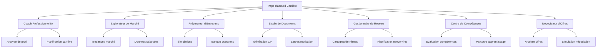

# Carrière / Pro - Exigences Produit

## 1. Vue d'ensemble du produit

La section "Carrière / Pro" est une suite complète d'outils de développement professionnel intégrée à l'application "À Votre Service". Elle offre 7 modules spécialisés pour accompagner les utilisateurs dans leur évolution de carrière, de la planification stratégique à la négociation d'offres.

Cette suite vise à démocratiser l'accès aux outils de développement professionnel en proposant une solution tout-en-un, alimentée par l'IA, pour optimiser les parcours de carrière et maximiser les opportunités professionnelles.

## 2. Fonctionnalités principales

### 2.1 Rôles utilisateur

| Rôle                 | Méthode d'inscription | Permissions principales                                 |
| -------------------- | --------------------- | ------------------------------------------------------- |
| Utilisateur Standard | Inscription email     | Accès aux outils de base, sauvegarde locale             |
| Utilisateur Premium  | Upgrade payant        | Accès complet, synchronisation cloud, analyses avancées |

### 2.2 Module de fonctionnalités

Notre suite Carrière / Pro comprend les pages principales suivantes :

1. **Page d'accueil Carrière** : tableau de bord unifié, indicateurs de progression, navigation vers les outils
2. **Coach Professionnel IA** : analyse de profil, recommandations personnalisées, planification de carrière
3. **Explorateur de Marché** : tendances sectorielles, données salariales, opportunités géographiques
4. **Préparateur d'Entretiens** : simulations, banque de questions, feedback IA
5. **Studio de Documents** : génération CV/lettres, optimisation ATS, templates sectoriels
6. **Gestionnaire de Réseau** : cartographie contacts, suivi interactions, planification networking
7. **Centre de Compétences** : évaluation skills, parcours d'apprentissage, certifications
8. **Négociateur d'Offres** : analyse comparative, simulateur salarial, guide contractuel

### 2.3 Détails des pages

| Nom de la page           | Nom du module               | Description des fonctionnalités                                                                                    |
| ------------------------ | --------------------------- | ------------------------------------------------------------------------------------------------------------------ |
| Page d'accueil Carrière  | Tableau de bord             | Afficher indicateurs de progression, statistiques personnelles, accès rapide aux outils, notifications importantes |
| Coach Professionnel IA   | Analyseur de profil         | Analyser profil professionnel complet, générer recommandations personnalisées, créer plans de transition           |
| Coach Professionnel IA   | Planificateur carrière      | Définir objectifs court/moyen/long terme, suivre progression, ajuster stratégies                                   |
| Explorateur de Marché    | Analyseur tendances         | Analyser tendances marché en temps réel, identifier métiers porteurs, comparer secteurs                            |
| Explorateur de Marché    | Base données salariales     | Consulter fourchettes salariales détaillées, analyser par région/expérience, alertes opportunités                  |
| Préparateur d'Entretiens | Simulateur entretiens       | Simuler entretiens avec questions adaptatives, analyser réponses STAR, feedback IA                                 |
| Préparateur d'Entretiens | Banque de questions         | Accéder questions par métier/séniorité, préparer réponses types, gérer stress                                      |
| Studio de Documents      | Générateur CV               | Créer CV optimisés ATS, templates sectoriels, analyse compatibilité offres                                         |
| Studio de Documents      | Créateur lettres motivation | Générer lettres personnalisées, optimiser profil LinkedIn, versioning documents                                    |
| Gestionnaire de Réseau   | Cartographe contacts        | Visualiser réseau professionnel, analyser connexions, identifier opportunités                                      |
| Gestionnaire de Réseau   | Planificateur networking    | Programmer relances automatiques, gérer événements, templates messages                                             |
| Centre de Compétences    | Évaluateur skills           | Évaluer compétences techniques/comportementales, identifier écarts, matrice évolutive                              |
| Centre de Compétences    | Parcours apprentissage      | Recommander formations personnalisées, suivre certifications, intégrer plateformes                                 |
| Négociateur d'Offres     | Analyseur offres            | Comparer packages salariaux, analyser avantages sectoriels, calculer compensation totale                           |
| Négociateur d'Offres     | Simulateur négociation      | Simuler scénarios négociation, rédiger contre-propositions, guide clauses légales                                  |

## 3. Processus principal

### Flux utilisateur principal

1. **Découverte** : L'utilisateur accède à la section Carrière depuis le menu latéral
2. **Évaluation initiale** : Le Coach IA analyse le profil et propose un parcours personnalisé
3. **Exploration** : L'utilisateur explore les opportunités via l'Explorateur de Marché
4. **Préparation** : Utilisation du Studio de Documents et du Préparateur d'Entretiens
5. **Networking** : Gestion et développement du réseau professionnel
6. **Développement** : Formation continue via le Centre de Compétences
7. **Négociation** : Optimisation des offres avec le Négociateur

## 4. Design de l'interface utilisateur

### 4.1 Style de design

* **Couleurs principales** : Bleu professionnel (#2563eb), Vert croissance (#059669)

* **Couleurs secondaires** : Gris moderne (#64748b), Orange accent (#ea580c)

* **Style des boutons** : Arrondis modernes avec effets de survol subtils

* **Police** : Inter pour la lisibilité, tailles 14px (corps), 18px (titres), 24px (en-têtes)

* **Style de mise en page** : Cartes avec ombres légères, navigation par onglets, sidebar responsive

* **Icônes** : Lucide React avec style cohérent, emojis pour les accents visuels

### 4.2 Aperçu du design des pages

| Nom de la page           | Nom du module               | Éléments UI                                                                                                         |
| ------------------------ | --------------------------- | ------------------------------------------------------------------------------------------------------------------- |
| Page d'accueil Carrière  | Tableau de bord             | Layout en grille responsive, cartes statistiques avec graphiques, navigation par icônes colorées, palette bleu/vert |
| Coach Professionnel IA   | Interface conversationnelle | Chat IA avec bulles stylisées, formulaires progressifs, visualisations de parcours, animations fluides              |
| Explorateur de Marché    | Visualisations données      | Graphiques interactifs, cartes géographiques, tableaux comparatifs, filtres avancés                                 |
| Préparateur d'Entretiens | Interface simulation        | Écran de simulation immersif, chronomètre visuel, feedback coloré, enregistrement audio/vidéo                       |
| Studio de Documents      | Éditeur visuel              | Interface WYSIWYG, prévisualisation temps réel, templates gallery, système de versions                              |
| Gestionnaire de Réseau   | Visualisation réseau        | Graphiques de réseau interactifs, calendrier intégré, cartes de contacts, timeline interactions                     |
| Centre de Compétences    | Matrice compétences         | Radar charts, barres de progression, badges certifications, parcours visuels                                        |
| Négociateur d'Offres     | Calculateurs avancés        | Formulaires multi-étapes, comparateurs visuels, simulateurs interactifs, guides contextuels                         |

### 4.3 Responsivité

Interface desktop-first avec adaptation mobile complète, optimisation tactile pour les interactions, navigation par onglets collapsible sur mobile, accessibilité WCAG 2.1 AA.

## 5. Intégrations techniques

### 5.1 API LLM

* Utilisation de l'API LLM configurée dans l'application

* Prompts spécialisés pour chaque module

* Gestion des formats de sortie (HTML, Markdown, JSON)

* Interprétation de codes (Mermaid pour diagrammes, LaTeX pour formules)

### 5.2 Synchronisation données

* Sauvegarde locale avec IndexedDB

* Synchronisation cloud pour utilisateurs premium

* Export/import universel des données

* Système de backup automatique

### 5.3 Analytics et métriques

* Suivi de progression utilisateur

* Métriques d'utilisation des outils

* Analyses de performance des recommandations IA

* Tableaux de bord personnalisés

