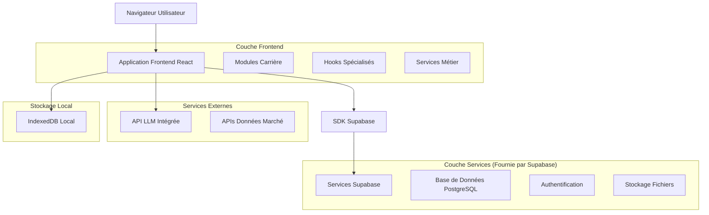
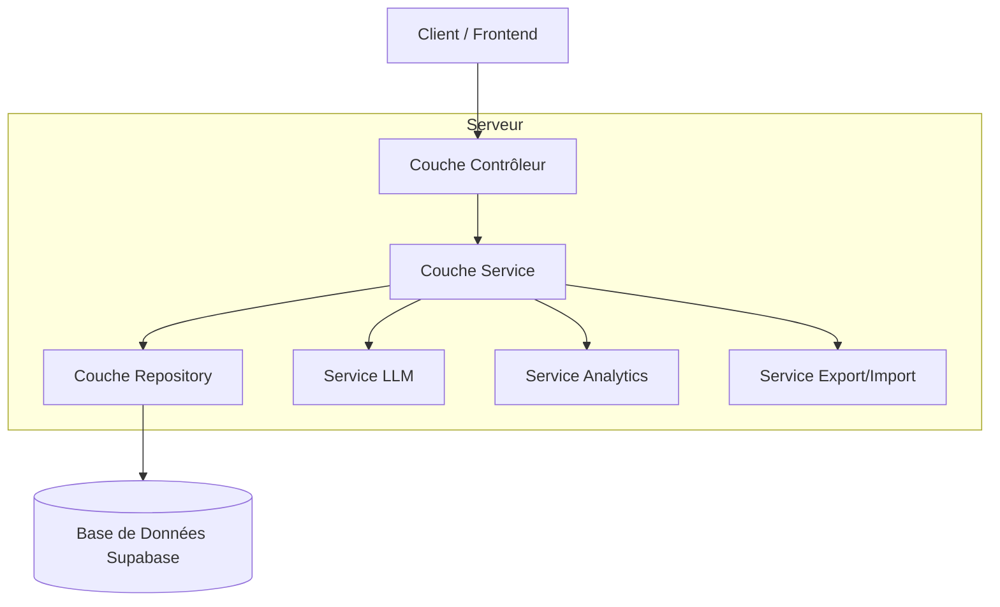
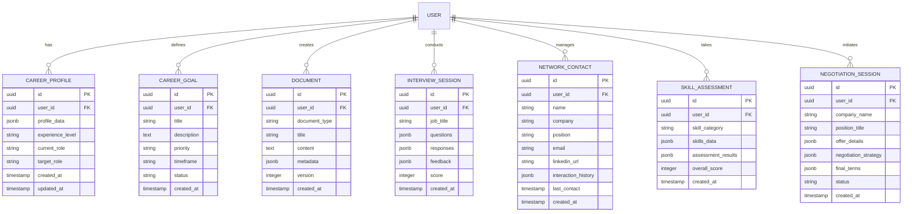

# Architecture Technique - Section Carrière / Pro

## 1. Conception de l'architecture



## 2. Description des technologies

* **Frontend** : React\@18 + TypeScript + Tailwind CSS\@3 + Vite

* **Backend** : Supabase (PostgreSQL + Auth + Storage)

* **État local** : Zustand + IndexedDB pour persistance

* **UI Components** : Shadcn/ui + Lucide React

* **Graphiques** : Recharts + D3.js pour visualisations avancées

* **IA** : API LLM intégrée de l'application

## 3. Définitions des routes

| Route                   | Objectif                                                   |
| ----------------------- | ---------------------------------------------------------- |
| /career                 | Page d'accueil de la section Carrière avec tableau de bord |
| /career/ai-coach        | Coach Professionnel IA avec analyse et recommandations     |
| /career/market-explorer | Explorateur de marché et données sectorielles              |
| /career/interview-prep  | Préparateur d'entretiens avec simulations                  |
| /career/documents       | Studio de documents professionnels                         |
| /career/networking      | Gestionnaire de réseau professionnel                       |
| /career/skills          | Centre de développement des compétences                    |
| /career/negotiation     | Négociateur d'offres et contrats                           |

## 4. Définitions des APIs

### 4.1 APIs principales

**Analyse de profil professionnel**

```
POST /api/career/profile-analysis
```

Requête :

| Nom du paramètre  | Type   | Obligatoire | Description                               |
| ----------------- | ------ | ----------- | ----------------------------------------- |
| profile\_data     | object | true        | Données du profil utilisateur             |
| career\_goals     | array  | true        | Objectifs de carrière                     |
| experience\_level | string | true        | Niveau d'expérience (junior, mid, senior) |

Réponse :

| Nom du paramètre | Type   | Description                    |
| ---------------- | ------ | ------------------------------ |
| analysis         | object | Analyse complète du profil     |
| recommendations  | array  | Recommandations personnalisées |
| career\_path     | object | Plan de carrière suggéré       |

**Données de marché du travail**

```
GET /api/career/market-data
```

Requête :

| Nom du paramètre  | Type   | Obligatoire | Description               |
| ----------------- | ------ | ----------- | ------------------------- |
| sector            | string | false       | Secteur d'activité        |
| location          | string | false       | Localisation géographique |
| experience\_level | string | false       | Niveau d'expérience       |

Réponse :

| Nom du paramètre   | Type   | Description            |
| ------------------ | ------ | ---------------------- |
| trends             | array  | Tendances du marché    |
| salary\_ranges     | object | Fourchettes salariales |
| job\_opportunities | array  | Opportunités d'emploi  |

**Génération de documents**

```
POST /api/career/generate-document
```

Requête :

| Nom du paramètre | Type   | Obligatoire | Description                                    |
| ---------------- | ------ | ----------- | ---------------------------------------------- |
| document\_type   | string | true        | Type de document (cv, cover\_letter, linkedin) |
| user\_profile    | object | true        | Profil utilisateur                             |
| job\_description | string | false       | Description du poste ciblé                     |
| template\_id     | string | false       | ID du template à utiliser                      |

Réponse :

| Nom du paramètre  | Type   | Description                |
| ----------------- | ------ | -------------------------- |
| document\_content | string | Contenu généré du document |
| ats\_score        | number | Score d'optimisation ATS   |
| suggestions       | array  | Suggestions d'amélioration |

Exemple :

```json
{
  "document_type": "cv",
  "user_profile": {
    "name": "Jean Dupont",
    "experience": "5 ans en développement web",
    "skills": ["React", "Node.js", "TypeScript"]
  },
  "job_description": "Développeur Frontend Senior - React/TypeScript"
}
```

## 5. Architecture serveur



## 6. Modèle de données

### 6.1 Définition du modèle de données



### 6.2 Langage de définition des données

**Table Profil Carrière (career\_profiles)**

```sql
-- Création de la table
CREATE TABLE career_profiles (
    id UUID PRIMARY KEY DEFAULT gen_random_uuid(),
    user_id UUID REFERENCES auth.users(id) ON DELETE CASCADE,
    profile_data JSONB NOT NULL DEFAULT '{}',
    experience_level VARCHAR(20) CHECK (experience_level IN ('junior', 'mid', 'senior', 'executive')),
    current_role VARCHAR(255),
    target_role VARCHAR(255),
    created_at TIMESTAMP WITH TIME ZONE DEFAULT NOW(),
    updated_at TIMESTAMP WITH TIME ZONE DEFAULT NOW()
);

-- Création des index
CREATE INDEX idx_career_profiles_user_id ON career_profiles(user_id);
CREATE INDEX idx_career_profiles_experience_level ON career_profiles(experience_level);

-- Permissions Supabase
GRANT SELECT ON career_profiles TO anon;
GRANT ALL PRIVILEGES ON career_profiles TO authenticated;
```

**Table Objectifs Carrière (career\_goals)**

```sql
-- Création de la table
CREATE TABLE career_goals (
    id UUID PRIMARY KEY DEFAULT gen_random_uuid(),
    user_id UUID REFERENCES auth.users(id) ON DELETE CASCADE,
    title VARCHAR(255) NOT NULL,
    description TEXT,
    priority VARCHAR(10) CHECK (priority IN ('low', 'medium', 'high')),
    timeframe VARCHAR(20) CHECK (timeframe IN ('short', 'medium', 'long')),
    status VARCHAR(20) DEFAULT 'active' CHECK (status IN ('active', 'completed', 'paused', 'cancelled')),
    created_at TIMESTAMP WITH TIME ZONE DEFAULT NOW()
);

-- Création des index
CREATE INDEX idx_career_goals_user_id ON career_goals(user_id);
CREATE INDEX idx_career_goals_status ON career_goals(status);
CREATE INDEX idx_career_goals_priority ON career_goals(priority);

-- Permissions Supabase
GRANT SELECT ON career_goals TO anon;
GRANT ALL PRIVILEGES ON career_goals TO authenticated;
```

**Table Documents (career\_documents)**

```sql
-- Création de la table
CREATE TABLE career_documents (
    id UUID PRIMARY KEY DEFAULT gen_random_uuid(),
    user_id UUID REFERENCES auth.users(id) ON DELETE CASCADE,
    document_type VARCHAR(50) CHECK (document_type IN ('cv', 'cover_letter', 'linkedin_profile', 'portfolio')),
    title VARCHAR(255) NOT NULL,
    content TEXT NOT NULL,
    metadata JSONB DEFAULT '{}',
    version INTEGER DEFAULT 1,
    created_at TIMESTAMP WITH TIME ZONE DEFAULT NOW()
);

-- Création des index
CREATE INDEX idx_career_documents_user_id ON career_documents(user_id);
CREATE INDEX idx_career_documents_type ON career_documents(document_type);
CREATE INDEX idx_career_documents_created_at ON career_documents(created_at DESC);

-- Permissions Supabase
GRANT SELECT ON career_documents TO anon;
GRANT ALL PRIVILEGES ON career_documents TO authenticated;
```

**Table Sessions d'Entretien (interview\_sessions)**

```sql
-- Création de la table
CREATE TABLE interview_sessions (
    id UUID PRIMARY KEY DEFAULT gen_random_uuid(),
    user_id UUID REFERENCES auth.users(id) ON DELETE CASCADE,
    job_title VARCHAR(255) NOT NULL,
    questions JSONB DEFAULT '[]',
    responses JSONB DEFAULT '[]',
    feedback JSONB DEFAULT '{}',
    score INTEGER CHECK (score >= 0 AND score <= 100),
    created_at TIMESTAMP WITH TIME ZONE DEFAULT NOW()
);

-- Création des index
CREATE INDEX idx_interview_sessions_user_id ON interview_sessions(user_id);
CREATE INDEX idx_interview_sessions_score ON interview_sessions(score DESC);
CREATE INDEX idx_interview_sessions_created_at ON interview_sessions(created_at DESC);

-- Permissions Supabase
GRANT SELECT ON interview_sessions TO anon;
GRANT ALL PRIVILEGES ON interview_sessions TO authenticated;
```

**Données initiales**

```sql
-- Insertion de données de test pour le développement
INSERT INTO career_profiles (user_id, profile_data, experience_level, current_role, target_role)
VALUES (
    '00000000-0000-0000-0000-000000000000',
    '{"skills": ["React", "TypeScript", "Node.js"], "industries": ["Tech", "Startup"]}',
    'mid',
    'Développeur Frontend',
    'Lead Developer'
);

INSERT INTO career_goals (user_id, title, description, priority, timeframe)
VALUES (
    '00000000-0000-0000-0000-000000000000',
    'Obtenir une promotion',
    'Évoluer vers un poste de Lead Developer dans les 12 prochains mois',
    'high',
    'medium'
);
```

