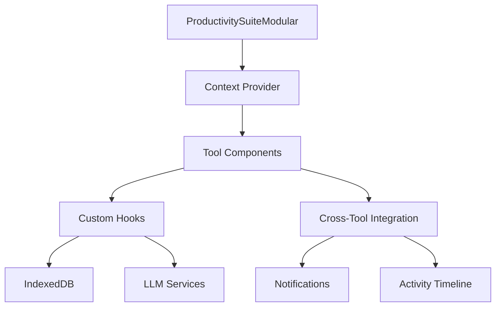

# Structure et Architecture - Suites d'Outils

## Vue d'ensemble de l'Architecture

Les suites d'outils **À Votre Service** suivent une architecture modulaire et extensible basée sur React, TypeScript et des patterns modernes de développement. Cette documentation couvre l'architecture de la **Finance & Budget Suite** et de l'**Organisation Productive**.

# Finance & Budget Suite - Structure et Architecture

## Vue d'ensemble de l'Architecture Financière

La suite **Finance & Budget Suite** implémente une architecture spécialisée pour les calculs financiers complexes, la gestion de données sensibles et les analyses prédictives.

## Structure des Fichiers Financiers

```
src/components/tools/finance/
│
├── 💰 FinanceBudgetSuite.tsx               # 🎯 Composant racine financier
│   ├── Système d'onglets spécialisé finance
│   ├── Gestion sécurisée des données
│   ├── Chiffrement des données sensibles
│   └── Intégration APIs financières
│
├── 📁 components/                          # 🧩 Composants financiers
│   ├── 🏦 LoanCalculator.tsx              # Calculateur de prêts
│   │   ├── Calculs d'amortissement
│   │   ├── Tableaux de remboursement
│   │   ├── Simulations scénarios
│   │   └── Export rapports PDF
│   │
│   ├── 📊 BudgetPlanner.tsx               # Planificateur budget
│   │   ├── Catégorisation intelligente
│   │   ├── Prédictions flux trésorerie
│   │   ├── Alertes dépassement
│   │   └── Optimisation IA
│   │
│   ├── 📈 InvestmentCalculator.tsx        # Calculateur investissements
│   │   ├── Calculs ROI/IRR/NPV
│   │   ├── Analyse Monte Carlo
│   │   ├── Optimisation portefeuille
│   │   └── Backtesting stratégies
│   │
│   ├── 💎 SavingsSimulator.tsx            # Simulateur épargne
│   │   ├── Projections long terme
│   │   ├── Scénarios multiples
│   │   ├── Calculs inflation
│   │   └── Visualisations graphiques
│   │
│   ├── 🏖️ RetirementCalculator.tsx        # Calculateur retraite
│   │   ├── Estimation besoins financiers
│   │   ├── Calculs rentes/pensions
│   │   ├── Optimisation fiscale
│   │   └── Scénarios retraite anticipée
│   │
│   ├── 💳 DebtAnalyzer.tsx                # Analyseur dettes
│   │   ├── Stratégies remboursement
│   │   ├── Méthode Avalanche/Boule neige
│   │   ├── Consolidation dettes
│   │   └── Calendrier optimisé
│   │
│   ├── 💱 CurrencyConverter.tsx           # Convertisseur devises
│   │   ├── Taux temps réel
│   │   ├── Historique 5 ans
│   │   ├── Alertes fluctuation
│   │   └── Support 150+ devises
│   │
│   ├── 📋 FinancialDashboard.tsx          # Tableaux bord financiers
│   │   ├── KPIs temps réel
│   │   ├── Graphiques tendances
│   │   ├── Répartition actifs
│   │   └── Rapports personnalisables
│   │
│   ├── 🛡️ InsuranceCalculator.tsx         # Calculateur assurance
│   │   ├── Assurance vie/habitation/auto
│   │   ├── Évaluation besoins couverture
│   │   ├── Comparaison offres
│   │   └── Optimisation primes
│   │
│   └── 📋 TaxPlanner.tsx                  # Planificateur fiscal
│       ├── Calculs impôts revenus
│       ├── Stratégies réduction fiscale
│       ├── Planification déductions
│       └── Simulation scénarios
│
├── 📁 hooks/                              # 🔧 Hooks financiers
│   ├── 🧮 useFinancialCalculations.ts     # Calculs financiers
│   │   ├── Formules mathématiques
│   │   ├── Algorithmes optimisés
│   │   ├── Cache résultats
│   │   └── Historique calculs
│   │
│   ├── 💱 useCurrencyRates.ts             # Taux de change
│   │   ├── API temps réel
│   │   ├── Cache intelligent
│   │   ├── Mise à jour automatique
│   │   └── Gestion erreurs réseau
│   │
│   ├── 📊 useFinancialAnalytics.ts        # Analytics financiers
│   │   ├── KPIs automatiques
│   │   ├── Métriques performance
│   │   ├── Tendances prédictives
│   │   └── Alertes intelligentes
│   │
│   ├── 🏦 useLoanAmortization.ts          # Amortissement prêts
│   │   ├── Calculs tableaux amortissement
│   │   ├── Simulations remboursement
│   │   ├── Optimisation durée/taux
│   │   └── Comparaison offres
│   │
│   └── 📈 useInvestmentProjections.ts     # Projections investissement
│       ├── Modélisation rendements
│       ├── Analyse risques
│       ├── Diversification portefeuille
│       └── Recommandations IA
│
└── 📁 utils/                              # 🛠️ Utilitaires financiers
    ├── 🧮 financialFormulas.ts            # Formules financières
    │   ├── Intérêts composés/simples
    │   ├── VAN/TIR/Payback
    │   ├── Ratios financiers
    │   └── Calculs actuariels
    │
    ├── 💱 currencyUtils.ts                # Utilitaires devises
    │   ├── Formatage montants
    │   ├── Conversion automatique
    │   ├── Gestion symboles
    │   └── Validation formats
    │
    └── 📄 reportGenerator.ts              # Générateur rapports
        ├── Templates PDF professionnels
        ├── Graphiques intégrés
        ├── Export multi-formats
        └── Personnalisation branding
```

## Architecture Sécurisée des Données Financières

### Chiffrement et Sécurité

```typescript
// Gestionnaire de chiffrement des données sensibles
interface FinancialSecurityManager {
  encryptSensitiveData(data: FinancialData): EncryptedData;
  decryptSensitiveData(encryptedData: EncryptedData): FinancialData;
  hashUserIdentifiers(userId: string): string;
  validateDataIntegrity(data: FinancialData): boolean;
}

// Schema de données chiffrées
interface EncryptedFinancialRecord {
  id: string;
  encryptedData: string;  // AES-256 encrypted
  hash: string;          // SHA-256 integrity hash
  timestamp: number;
  version: string;
}
```

### Persistance Sécurisée IndexedDB

```javascript
const secureFinanceDB = {
  // Tables principales avec chiffrement
  budgets: { 
    keyPath: 'id', 
    indexes: ['userId_hash', 'category', 'period'],
    encryption: 'AES-256'
  },
  transactions: { 
    keyPath: 'id', 
    indexes: ['budgetId', 'date_encrypted', 'category'],
    encryption: 'AES-256'
  },
  investments: { 
    keyPath: 'id', 
    indexes: ['portfolioId_hash', 'type', 'purchaseDate'],
    encryption: 'AES-256'
  },
  loans: { 
    keyPath: 'id', 
    indexes: ['userId_hash', 'type', 'startDate'],
    encryption: 'AES-256'
  },
  
  // Tables de cache (non sensibles)
  currencyRates: { 
    keyPath: 'code', 
    indexes: ['lastUpdated'],
    encryption: 'none'
  },
  marketData: { 
    keyPath: 'symbol', 
    indexes: ['lastUpdated', 'type'],
    encryption: 'none'
  }
};
```

---

# Organisation Productive - Structure et Architecture

## Vue d'ensemble de l'Architecture Productive

La suite **Organisation Productive** suit une architecture modulaire et extensible basée sur React, TypeScript et des patterns modernes de développement.

## Structure des Fichiers

```
src/components/tools/productivity/
│
├── 📁 ProductivitySuiteModular.tsx          # 🎯 Composant racine
│   ├── Système d'onglets responsive
│   ├── Gestion de l'état global
│   ├── Lazy loading des composants
│   └── Intégration cross-tool
│
├── 📁 components/                           # 🧩 Composants des outils
│   ├── 📝 TodoList.tsx                     # To-Do List améliorée
│   │   ├── Gestion des catégories
│   │   ├── Système de priorités
│   │   ├── Filtrage avancé
│   │   └── Export/Import
│   │
│   ├── 🎯 TaskManager.tsx                  # Gestionnaire de tâches IA
│   │   ├── Décomposition automatique
│   │   ├── Estimation de durée IA
│   │   ├── Gestion des dépendances
│   │   └── Analytics de performance
│   │
│   ├── 🏆 GoalTracker.tsx                  # Suivi d'objectifs SMART
│   │   ├── Assistant IA SMART
│   │   ├── Décomposition en jalons
│   │   ├── Suivi de progression
│   │   └── Coaching personnalisé
│   │
│   ├── ⏰ PomodoroTimer.tsx                # Timer Pomodoro analytics
│   │   ├── Cycles personnalisables
│   │   ├── Statistiques détaillées
│   │   ├── Intégration tâches
│   │   └── Rapports automatiques
│   │
│   ├── 📚 NotesManager.tsx                 # Gestionnaire de notes
│   │   ├── Système de tags
│   │   ├── Recherche full-text
│   │   ├── Éditeur Markdown
│   │   └── Liens bidirectionnels
│   │
│   ├── 📊 KanbanBoard.tsx                  # Tableau Kanban métriques
│   │   ├── Drag & drop fluide
│   │   ├── Métriques Lean/Agile
│   │   ├── Détection goulots
│   │   └── Analytics de flux
│   │
│   └── 🎯 EisenhowerMatrix.tsx             # Matrice Eisenhower IA
│       ├── Classification automatique
│       ├── Analytics productivité
│       ├── Détection burnout
│       └── Recommandations IA
│
├── 📁 hooks/                               # 🔧 Hooks personnalisés
│   ├── 🔗 useCrossToolIntegration.ts       # Intégration cross-tool
│   │   ├── Références croisées
│   │   ├── Notifications temps réel
│   │   ├── Timeline d'activité
│   │   └── Commentaires/Pièces jointes
│   │
│   ├── 🤖 useTaskDecomposition.ts          # Décomposition IA
│   │   ├── Interface LLM
│   │   ├── Génération sous-tâches
│   │   ├── Gestion erreurs
│   │   └── Configuration fournisseurs
│   │
│   ├── 🧠 useLLMManager.ts                 # Gestionnaire LLM
│   │   ├── Multi-fournisseurs (OpenAI, Anthropic)
│   │   ├── Gestion des tokens
│   │   ├── Fallbacks et retry
│   │   └── Configuration dynamique
│   │
│   ├── 📈 useKanbanMetrics.ts              # Métriques Kanban
│   │   ├── Calcul cycle time
│   │   ├── Throughput analysis
│   │   ├── WIP limits monitoring
│   │   └── Prédictions de livraison
│   │
│   └── 📊 useEisenhowerAnalytics.ts        # Analytics Eisenhower
│       ├── Distribution par quadrant
│       ├── Métriques de focus
│       ├── Détection patterns
│       └── Insights personnalisés
│
└── 📁 utils/                               # 🛠️ Utilitaires
    └── 📤 exportUtils.ts                   # Export multi-formats
        ├── Export PDF/CSV/JSON
        ├── Génération rapports
        ├── Compression données
        └── Téléchargement automatique
```

## Architecture des Composants

### 🎯 Composant Principal (ProductivitySuiteModular)

```typescript
interface ProductivitySuiteProps {
  initialTab?: string;
  onTabChange?: (tabId: string) => void;
  integrationConfig?: IntegrationConfig;
}

const ProductivitySuiteModular: React.FC<ProductivitySuiteProps> = ({
  initialTab = 'todo',
  onTabChange,
  integrationConfig
}) => {
  // Gestion d'état global
  // Système d'onglets
  // Lazy loading
  // Cross-tool integration
};
```

### 🧩 Pattern des Composants Outils

Chaque outil suit le même pattern architectural :

```typescript
// Structure type d'un outil
interface ToolComponent {
  // Props standardisées
  props: {
    onDataChange?: (data: any) => void;
    crossToolRefs?: CrossReference[];
    integrationCallbacks?: IntegrationCallbacks;
  };
  
  // État local
  state: {
    items: ToolItem[];
    loading: boolean;
    error: string | null;
    filters: FilterConfig;
  };
  
  // Hooks personnalisés
  hooks: {
    useToolData: () => ToolDataHook;
    useToolActions: () => ToolActionsHook;
    useToolIntegration: () => IntegrationHook;
  };
}
```

## Flux de Données

### 🔄 Architecture de l'État



### 📊 Gestion des Données

1. **Persistance Locale (IndexedDB)**
   ```typescript
   interface DatabaseSchema {
     todos: TodoItem[];
     tasks: TaskItem[];
     goals: GoalItem[];
     notes: NoteItem[];
     pomodoroSessions: PomodoroSession[];
     kanbanCards: KanbanCard[];
     eisenhowerTasks: EisenhowerTask[];
     crossReferences: CrossReference[];
     activityLog: ActivityItem[];
   }
   ```

2. **Cache en Mémoire**
   - React Query pour cache intelligent
   - Invalidation automatique
   - Synchronisation optimiste

3. **Synchronisation Cross-Tool**
   - Event bus pour communication
   - Références bidirectionnelles
   - Mise à jour en cascade

## Intégrations et APIs

### 🤖 Intégration IA/LLM

```typescript
interface LLMProvider {
  name: string;
  apiKey: string;
  baseUrl: string;
  model: string;
  maxTokens: number;
  temperature: number;
}

interface LLMService {
  decomposeTask(task: string, context?: any): Promise<SubtaskData[]>;
  classifyEisenhower(task: string): Promise<EisenhowerQuadrant>;
  generateGoalMilestones(goal: string): Promise<Milestone[]>;
  analyzeProductivity(data: ProductivityData): Promise<Insights>;
}
```

### 🔗 Cross-Tool Integration

```typescript
interface CrossToolIntegration {
  // Références croisées
  createReference(source: ToolRef, target: ToolRef): CrossReference;
  getReferences(itemId: string): CrossReference[];
  
  // Notifications
  notify(event: ToolEvent): void;
  subscribe(toolId: string, callback: EventCallback): void;
  
  // Timeline d'activité
  logActivity(activity: ActivityItem): void;
  getTimeline(filters?: TimelineFilters): ActivityItem[];
  
  // Synchronisation
  syncData(toolId: string, data: any): void;
  onDataChange(toolId: string, callback: DataChangeCallback): void;
}
```

## Patterns de Développement

### 🎨 Design Patterns Utilisés

1. **Observer Pattern**
   - Notifications cross-tool
   - Mise à jour réactive

2. **Strategy Pattern**
   - Fournisseurs LLM interchangeables
   - Algorithmes d'export multiples

3. **Factory Pattern**
   - Création dynamique de composants
   - Instanciation de services

4. **Singleton Pattern**
   - Gestionnaire de base de données
   - Configuration globale

### 🔧 Hooks Personnalisés

```typescript
// Hook de base pour tous les outils
const useToolBase = <T>(toolId: string) => {
  const [data, setData] = useState<T[]>([]);
  const [loading, setLoading] = useState(false);
  const [error, setError] = useState<string | null>(null);
  
  // CRUD operations
  const create = useCallback((item: Omit<T, 'id'>) => { /* ... */ }, []);
  const update = useCallback((id: string, updates: Partial<T>) => { /* ... */ }, []);
  const remove = useCallback((id: string) => { /* ... */ }, []);
  
  // Integration hooks
  const { createReference, notify } = useCrossToolIntegration();
  
  return { data, loading, error, create, update, remove, createReference, notify };
};
```

## Performance et Optimisation

### ⚡ Stratégies d'Optimisation

1. **Code Splitting**
   ```typescript
   // Lazy loading des composants
   const TodoList = lazy(() => import('./components/TodoList'));
   const TaskManager = lazy(() => import('./components/TaskManager'));
   // ...
   ```

2. **Memoization**
   ```typescript
   // Composants memoizés
   const MemoizedToolComponent = memo(ToolComponent, (prev, next) => {
     return prev.data === next.data && prev.filters === next.filters;
   });
   ```

3. **Virtualisation**
   - Listes virtualisées pour grandes datasets
   - Pagination intelligente
   - Rendu conditionnel

4. **Debouncing**
   ```typescript
   // Recherche avec debounce
   const debouncedSearch = useMemo(
     () => debounce((query: string) => performSearch(query), 300),
     []
   );
   ```

## Sécurité et Confidentialité

### 🔒 Mesures de Sécurité

1. **Chiffrement des Données**
   ```typescript
   interface EncryptionService {
     encrypt(data: any, key: string): Promise<string>;
     decrypt(encryptedData: string, key: string): Promise<any>;
     generateKey(): string;
   }
   ```

2. **Validation des Entrées**
   ```typescript
   // Schémas de validation Zod
   const TaskSchema = z.object({
     title: z.string().min(1).max(200),
     description: z.string().optional(),
     priority: z.enum(['low', 'medium', 'high']),
     dueDate: z.date().optional()
   });
   ```

3. **Sanitisation**
   - Nettoyage des entrées utilisateur
   - Protection XSS
   - Validation des uploads

## Tests et Qualité

### 🧪 Stratégie de Tests

```typescript
// Tests unitaires
describe('TaskManager', () => {
  test('should decompose task with AI', async () => {
    const mockLLM = jest.fn().mockResolvedValue(mockSubtasks);
    const { result } = renderHook(() => useTaskDecomposition(mockLLM));
    
    await act(async () => {
      await result.current.decomposeTask('Complex task');
    });
    
    expect(result.current.subtasks).toHaveLength(3);
  });
});

// Tests d'intégration
describe('Cross-Tool Integration', () => {
  test('should create reference between tools', () => {
    const integration = new CrossToolIntegration();
    const ref = integration.createReference(
      { toolId: 'todo', itemId: '1' },
      { toolId: 'kanban', itemId: '2' }
    );
    
    expect(ref.sourceToolId).toBe('todo');
    expect(ref.targetToolId).toBe('kanban');
  });
});
```

## Déploiement et Monitoring

### 📈 Métriques de Performance

```typescript
interface PerformanceMetrics {
  // Métriques techniques
  loadTime: number;
  renderTime: number;
  memoryUsage: number;
  bundleSize: number;
  
  // Métriques utilisateur
  toolUsage: Record<string, number>;
  featureAdoption: Record<string, number>;
  errorRate: number;
  userSatisfaction: number;
}
```

### 🚀 Pipeline de Déploiement

1. **Build Optimisé**
   - Tree shaking
   - Minification
   - Compression gzip

2. **Tests Automatisés**
   - Tests unitaires
   - Tests d'intégration
   - Tests E2E

3. **Monitoring**
   - Métriques de performance
   - Tracking des erreurs
   - Analytics d'usage

## Roadmap Architectural

### 🔮 Évolutions Prévues

1. **Phase 1 - Optimisation**
   - Amélioration des performances
   - Réduction de la taille des bundles
   - Optimisation mobile

2. **Phase 2 - Extensibilité**
   - API publique pour plugins
   - Système de thèmes avancé
   - Intégrations tierces

3. **Phase 3 - Collaboration**
   - Mode multi-utilisateurs
   - Synchronisation cloud
   - Partage en temps réel

4. **Phase 4 - Intelligence**
   - IA prédictive avancée
   - Recommandations personnalisées
   - Automatisation intelligente

---

*Cette structure évolue continuellement pour s'adapter aux besoins des utilisateurs et aux meilleures pratiques de développement.*